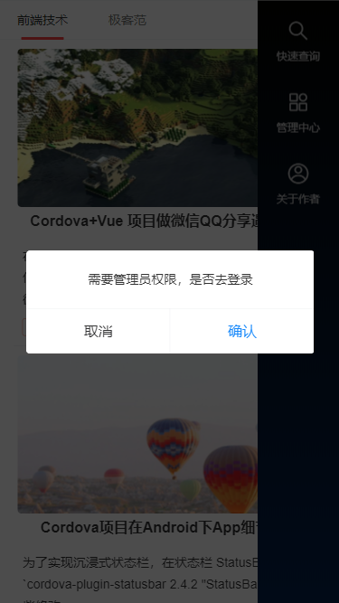
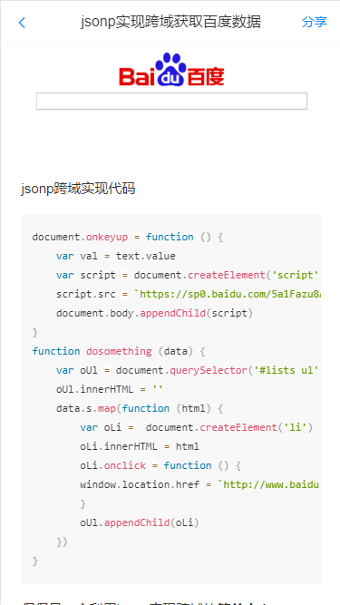
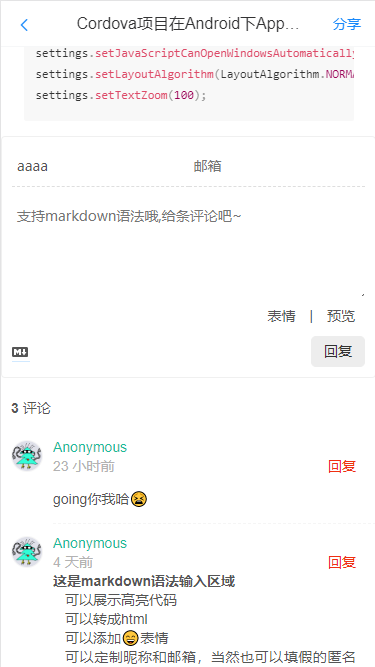
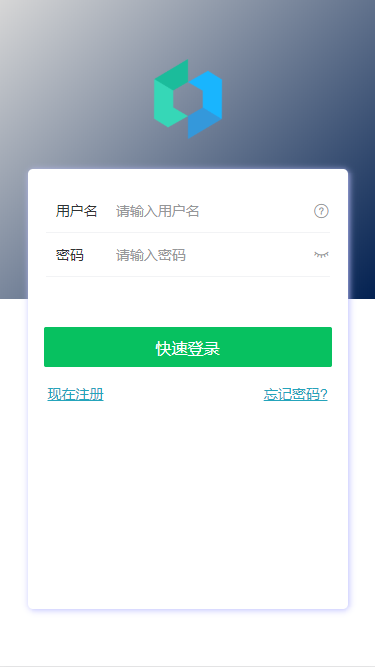
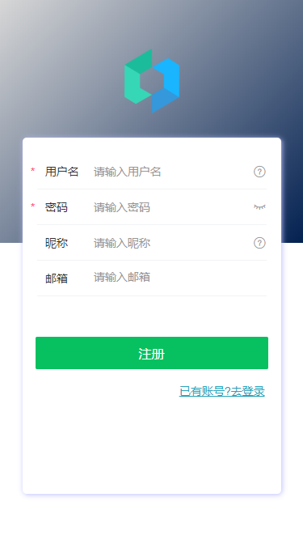

> 这个是本科毕业时做的毕业设计项目，想留份纪念，就搬运到了github上 🧐

# 毕业设计


一款基于VueJs + Leancloud 开发的个人博客app

 - Vant-ui进行界面开发
 - Leancloud 完成登录注册以及文章和其他数据的存储
 - marked解析markdown
 - valine完成用户评论功能
 - prismjs高亮代码,非常漂亮~
 - 文章发布、管理功能正在完善中。。。

欢迎交流探讨

## 页面展示

主页 


主页


侧边抽屉


弹出层 



文章详情 



文章详情 


文章评论 



文章搜索 


登录 



注册 



个人中心 


线上地址：[https://hackerhanxi.gitee.io/bsblog](https://hackerhanxi.gitee.io/bsblog)

## 克隆项目
```
git clone git@github.com:hx-dl/bsblog.git
```

## 进入项目
```
cd bsblog
```
## 安装依赖
```
yarn
```
### 启动项目
```
yarn serve
```
### 项目构建
```
yarn build
```

